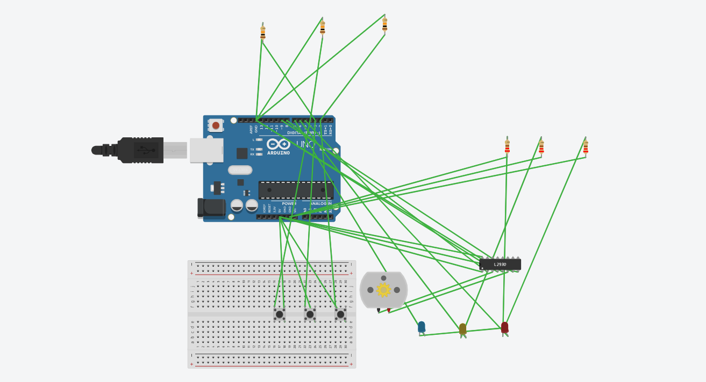

# 
**ARDUINO ELEVATOR DESIGN**

### **Table of Contents:**
1. <a href="#overview">Overview</a>
2. <a href="#hardware-components">Hardware components</a>
3. <a href="#code">Code</a>
4. <a href="#l293d-motor-driver-connections">L293D Motor driver connections</a>
5. <a href="#circuit-diagram">Circuit diagram</a>
6. <a href="#schematic-diagram">Schematic diagram</a>
7. <a href="#steps-to-follow">Steps to follow</a>
8. <a href="#demo-video">Demo video</a>
9. <a href="#future-modifications">Future modifications</a>
10. <a href="#direct-link">Direct link</a>

> ## ***OVERVIEW***
  **A simple arduino-based elevator design for three floors with two second travel time to each floor indicated by LEDs. Enabled by a DC motor installed with a L293D motor driver module. Designed in TinkerCAD.**

> ## ***HARDWARE COMPONENTS***
**1. Arduino UNO Rev3**  
**2. Breadboard (small)**  
**3. LEDs (3 in number, preferrably different colours)**  
**4. 10kΩ Pull-down resistors (3 in number)**
**5. 220Ω Current-limiting resistors (3 in number)**  
**6. Push buttons (3 in number)**  
**7. DC Motor**  
**8. 16-pin L293D Motor driver module**  
**9. Jumper wires**  

> ## ***CODE***
**Can be coded in <mark>C++ or Arduino IDE</mark> or any other compatible software.**
<pre><code>

const int motorPin1 = 8;  
const int motorPin2 = 9;  

const int button1 = 2;
const int button2 = 3;
const int button3 = 4;

const int led1 = 5;
const int led2 = 6;
const int led3 = 7;

int currentFloor = 1;

void setup() {
  pinMode(motorPin1, OUTPUT);
  pinMode(motorPin2, OUTPUT);

  pinMode(button1, INPUT);
  pinMode(button2, INPUT);
  pinMode(button3, INPUT);

  pinMode(led1, OUTPUT);
  pinMode(led2, OUTPUT);
  pinMode(led3, OUTPUT);

  updateLEDs();  
}

void loop() {
  int targetFloor = currentFloor;

  if (digitalRead(button1) == HIGH) {
    targetFloor = 1;
  } else if (digitalRead(button2) == HIGH) {
    targetFloor = 2;
  } else if (digitalRead(button3) == HIGH) {
    targetFloor = 3;
  }

  if (targetFloor != currentFloor) {
    moveToFloor(targetFloor);
    currentFloor = targetFloor;
    updateLEDs();
  }
}

void moveToFloor(int targetFloor) {
  int delayPerFloor = 2000; 

  int floorDiff = targetFloor - currentFloor;

  if (floorDiff > 0) {
    digitalWrite(motorPin1, HIGH);
    digitalWrite(motorPin2, LOW);
    delay(delayPerFloor * floorDiff);
  } else if (floorDiff < 0) {
    digitalWrite(motorPin1, LOW);
    digitalWrite(motorPin2, HIGH);
    delay(delayPerFloor * abs(floorDiff));
  }

  digitalWrite(motorPin1, LOW);
  digitalWrite(motorPin2, LOW);
}

void updateLEDs() {
  digitalWrite(led1, currentFloor == 1 ? HIGH : LOW);
  digitalWrite(led2, currentFloor == 2 ? HIGH : LOW);
  digitalWrite(led3, currentFloor == 3 ? HIGH : LOW);
}
</code></pre>
> ## ***L293D MOTOR DRIVER CONNECTIONS***

| **DRIVER PIN** | **CONNECTION** |
| ---------- | ---------- |
| Power 1    | Arduino 5V Pin |
| Enable 1&2 | Arduino 5V Pin |
| Output 1   | Motor Terminal 1 |
| Output 2   | Motor Terminal 2 | 
| Input 2    | Arduino Digital Pin 9 |
| Power 2    | Arduino 5V Pin |
| GND        | Arduino GND Pin |
| GND        | Arduino GND Pin |
| Input 1    | Arduino Digital Pin 8 |

> ## ***CIRCUIT DIAGRAM***

> ## ***SCHEMATIC DIAGRAM***

> ## ***STEPS TO FOLLOW***

- <mark>Pull-down resistors</mark> should be connected between the digital pin and the GND pin of the Arduino.

- <mark>Current-limiting resistors</mark> should be connected between the cathode leg of the LEDs and the GND pin of the Arduino to prevent frying of the LEDs.

- Ensure that the <mark>anode leg of the LEDs</mark> are connected to the corresponding digital pins(as enabled in the code) of the Arduino.

- <mark>Only 9 pins of the L293D Motor driver module</mark> are to be used as mentioned in the circuit diagram.

- Ensure that the hardware connections correspond to the written code to prevent non-functionality of the system.

> ## ***DEMO VIDEO***

***TO WATCH THE DEMO VIDEO*** --> [<ins>Click here</ins>](Recorded%20video.mp4)

> ## ***FUTURE MODIFICATIONS***

- An <mark>external buzzer</mark> can be installed to notify the user of the arrival at a particular floor.

- <mark>Display device</mark> to display the current floor.

- <mark>Alert button</mark> installation in case of emergencies.

> ## ***DIRECT LINK***

**To view TinkerCAD design -->** [<ins>Click here</ins>](https://www.tinkercad.com/things/ekkAHBsaQXY-ahilans-elevator-design) 

